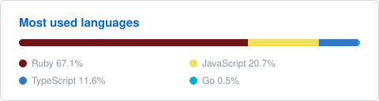

<h1 align="center">Hi! 👀   I'm Esteban 👋😊</h1>

---

I'm a senior software engineer based in Medellín, Colombia.

I'm 26 yo, Colombian, a Ruby/RoR lover 🔻, I like JS too, but Ruby is my main.

Lately I'm playing around a lot with AI stuff: MCP servers, agent skills, and building software with LLMs.

I like reading a lot, playing some video games and I also like watching some series and anime 📺.

 

### Technologies

  
   
  

 

### Currently building

- Software with quality that lasts for years, with the help of LLMs
- MCP servers
- Agent skills for Claude Code, Codex and OpenCode

 

### GitHub Stats

  
  

 

---

  
  

